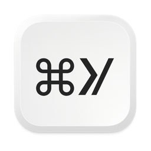
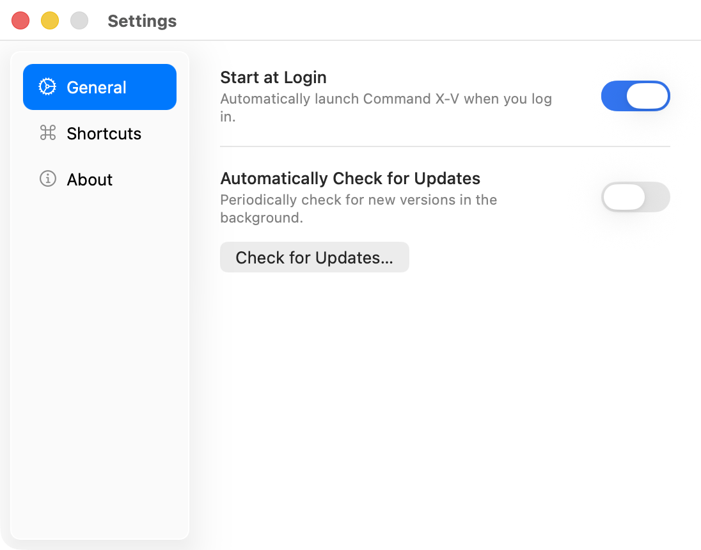
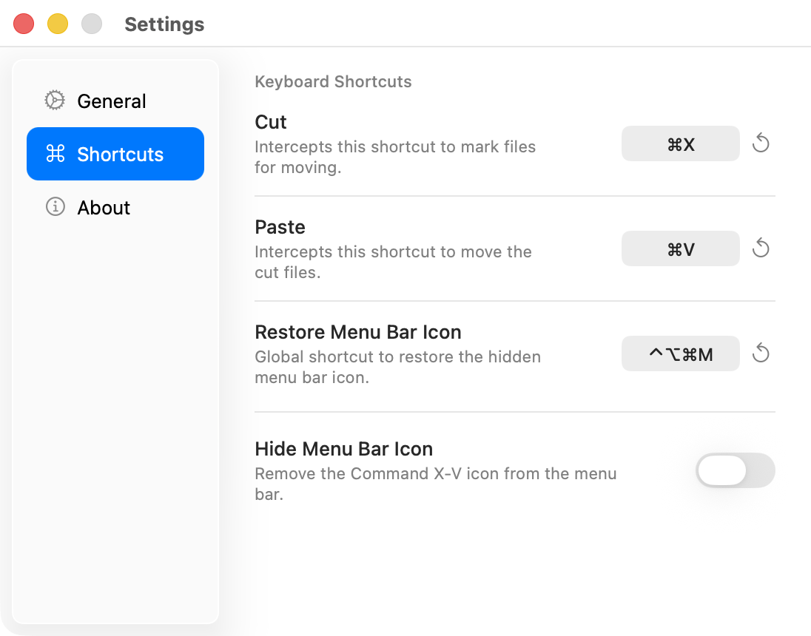

<div align="center">



# Command X-V

**Cut and paste files in macOS Finder with ⌘X and ⌘V.**

[](https://github.com/writronic/Command-X-V/releases/latest)


[](LICENSE)
[](https://github.com/sponsors/writronic)

</div>

---

Cut files with **⌘X**, move them with **⌘V** — the way it should have always worked. Command X-V plugs the missing shortcut into macOS Finder. No more `⌘C → ⌘⌥V` gymnastics.

Requires **macOS 13 Ventura** or later.

<p align="center">
  
  &nbsp;
  
</p>

## Features

- **True ⌘X Cut & ⌘V Paste** — Cut with ⌘X and paste (move) with ⌘V
- **Text Field Awareness** — Automatically detects when a text field (rename, search bar) is focused and passes ⌘X through for native text editing — no conflicts
- **Settings Window** — Dedicated settings panel with sidebar navigation: General preferences, Shortcuts customization, and About info
- **Customizable Shortcuts** — Reassign Cut, Paste, and Restore Menu Bar shortcuts via an interactive key recorder with conflict detection and one-click reset to defaults
- **Menu Bar App** — Lives entirely in the menu bar with a minimal dropdown: status indicator, Settings, and exit
- **Hide Menu Bar Icon** — Option to hide the icon completely; restore it anytime with `⌃⌥⌘M` or a Terminal command
- **Start at Login** — Starts automatically when you log in to your Mac
- **Welcome & Onboarding** — First-launch flow walks you through granting Accessibility permission with real-time status monitoring
- **Auto-Updates** — Built-in Sparkle integration for seamless over-the-air updates
- **macOS Tahoe Ready** — Full support for macOS 26 Tahoe

## Quick Start

Get up and running in under a minute:

### 1. Install

Download the latest `Command-X-V.dmg` from the [Releases page](https://github.com/writronic/Command-X-V/releases/latest), open it, and drag Command X-V to your Applications folder. The app ships as a **universal binary** (Apple Silicon + Intel). Every release is **code-signed, notarized, and stapled** by Apple.

### 2. Grant Permission

On first launch, Command X-V opens a welcome window asking for **Accessibility** permission. Click **Allow for Accessibility** to open System Settings, then add Command X-V to the allowed list. The app detects the permission change automatically.

### 3. Use It

That's it. Press **⌘X** to cut files in Finder, navigate to the destination, and press **⌘V** to move them.

> [!IMPORTANT]
> Command X-V requires **Accessibility permission** to function. Without it, the app cannot monitor keyboard events. You can grant this in **System Settings → Privacy & Security → Accessibility**.

## Hiding the Menu Bar Icon

If you prefer a completely invisible experience:

1. Open **Settings → Shortcuts**.
2. Enable **Hide Menu Bar Icon**.
3. A dialog shows you how to restore it later.
4. Click **Hide the icon** to confirm.

**To restore:**

- **Shortcut:** Press `Control (⌃) + Option (⌥) + Command (⌘) + M` from anywhere
- **Terminal:** Run `defaults write com.writronic.commandxv ShowMenuBarIcon -bool true` and restart the app

## Development

### Build from Source

1. Clone the repository:
   ```sh
   git clone https://github.com/writronic/Command-X-V.git
   cd Command-X-V
   ```
2. Open `Command-X-V.xcodeproj` in Xcode 16+.
3. Build and run the **Command X-V** scheme.

> [!NOTE]
> Command X-V uses [Sparkle](https://sparkle-project.org) via Swift Package Manager. Xcode resolves the dependency automatically on first open.

## Contributing

Contributions are welcome! Please read [CONTRIBUTING.md](.github/CONTRIBUTING.md) before getting started.

### Bug Reports & Feature Requests

Search existing [issues](https://github.com/writronic/Command-X-V/issues) before opening a [new one](https://github.com/writronic/Command-X-V/issues/new/choose). Provide clear reproduction steps for bugs and a concise rationale for feature requests.

### Code

Fork the repository, create a feature branch, and open a pull request. Keep changes focused and include relevant tests.

## License

Command X-V is available under the [GPL-3.0 license](LICENSE).

---

<div align="center">

**Made with ❤️ by [Writronic](https://writronic.com)**

</div>
